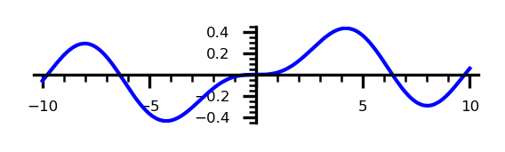

# banners
Banners for email signatures and things.

### [Some selected banner examples:](./banners/)

#### The 9th Amendment

  

#### Religeous Insanity in America

  

  

#### A Bessel Function (made with sagemath)

  

#### A quote from Einstein

  

#### First Three Measures of Op. 24 by E. Grieg (made with LilyPond)

  

### [Some selected background examples:](./backgrounds/)

  

